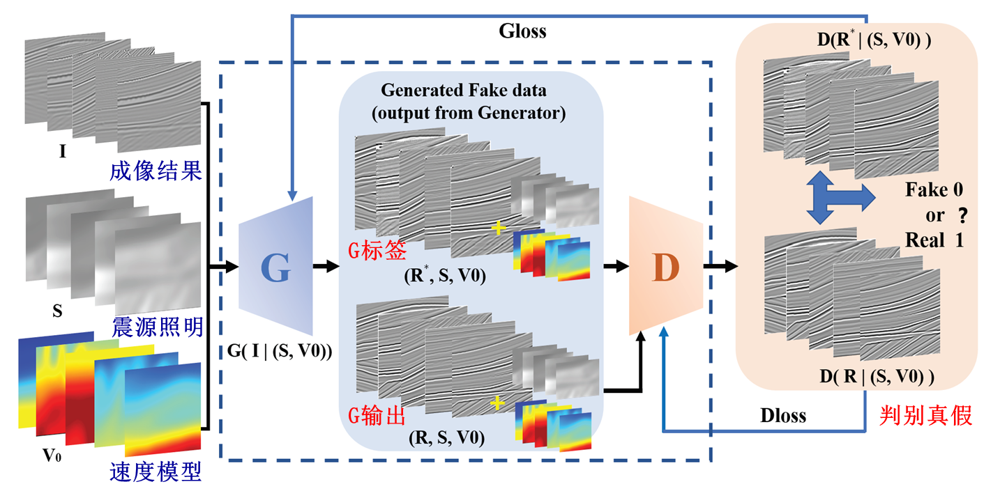
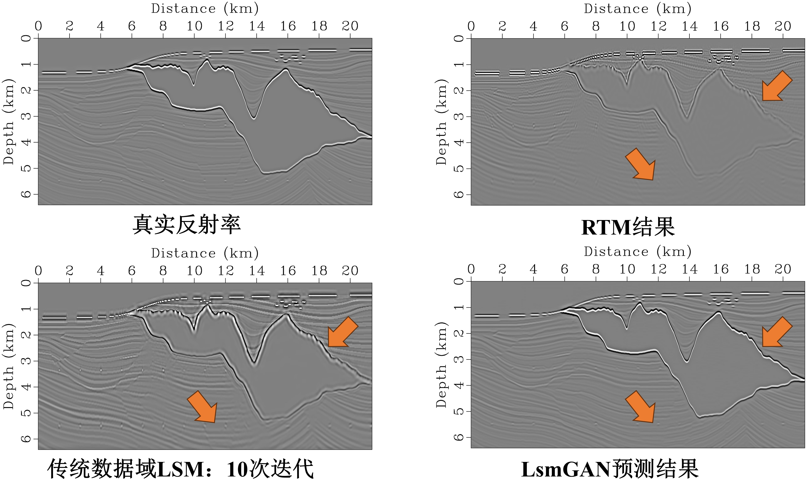
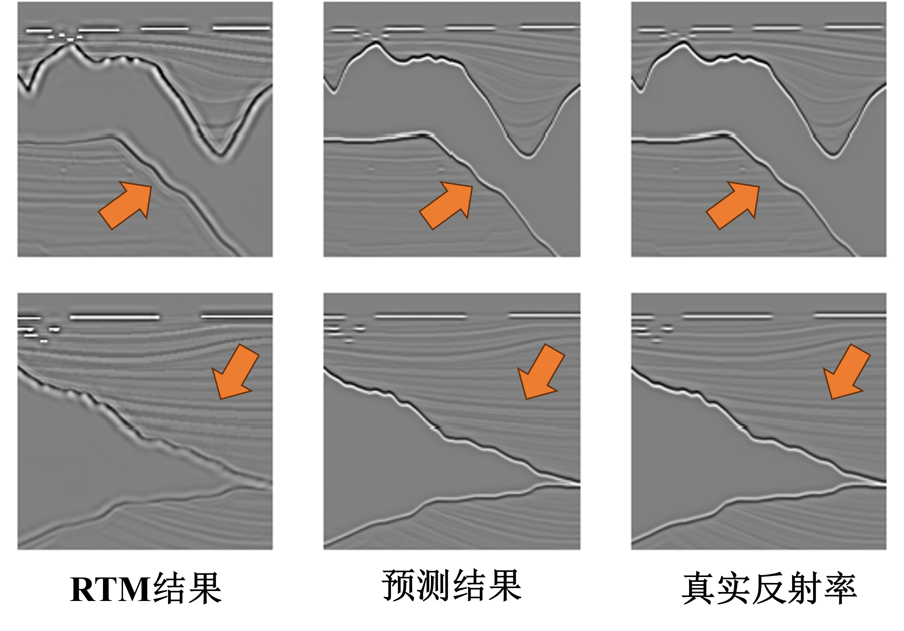

# LsmGANs: Image-domain least-squares migration using a new framework of generative adversarial networks

We develop a new GAN framework that is more suitable for the Hessian approximation of image-domain LSM, which is named as LsmGANs. In the new framework, we use a max-pooling instead of convolution to downsample the feature maps to capture horizontal and vertical variations of reflectors. This enables us to map reflection events to correct location in downsampling. To address the lateral discontinuity of events in the predicted image from conventional GANs, we further apply multiple transform layers to strengthen feature transformation to guide Hessian approximation. Finally, we add the skip connection in the transform layer to enhance the information exchange of the feature channels and avoid the gradient vanishing problem to improve image resolution. Below are the relevant figures and the full code.








## Link to related article

[click this link](https://ieeexplore.ieee.org/document/10215494) for more details.


## Publications

When using this model, please cite the following references:

**GB/T 7714:**

```
Sun J, Yang J, Huang J, et al. LsmGANs: Image-domain least-squares migration using a new framework of generative adversarial networks[J]. IEEE Transactions on Geoscience and Remote Sensing, 2023.
```

**Bib Tex:**

```
@article{sun2023lsmgans,
  title={LsmGANs: Image-domain least-squares migration using a new framework of generative adversarial networks},
  author={Sun, Jiaxing and Yang, Jidong and Huang, Jianping and Yu, Youcai and Li, Zhenchun and Zhao, Chong},
  journal={IEEE Transactions on Geoscience and Remote Sensing},
  year={2023},
  publisher={IEEE}
}
```
